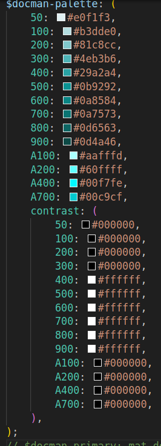
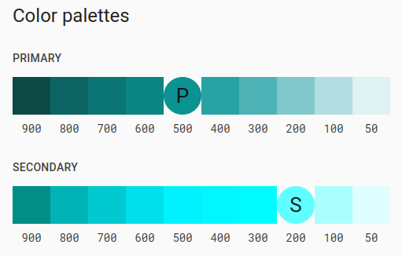

&nbsp;&nbsp;&nbsp;&nbsp;&nbsp;&nbsp;&nbsp;&nbsp;&nbsp;&nbsp;&nbsp;&nbsp;&nbsp;&nbsp;&nbsp;&nbsp;&nbsp;&nbsp;&nbsp;&nbsp;&nbsp;&nbsp;&nbsp;&nbsp;&nbsp;&nbsp;&nbsp;&nbsp;&nbsp;&nbsp;&nbsp;&nbsp;&nbsp;&nbsp;&nbsp;&nbsp;&nbsp;&nbsp;&nbsp;&nbsp;&nbsp;&nbsp;&nbsp;&nbsp;&nbsp;&nbsp;&nbsp;&nbsp;&nbsp;&nbsp;&nbsp;&nbsp;&nbsp;&nbsp;&nbsp;&nbsp;&nbsp;&nbsp;&nbsp;&nbsp;&nbsp;&nbsp;&nbsp;&nbsp;&nbsp;&nbsp;&nbsp;&nbsp;&nbsp;&nbsp;&nbsp;&nbsp;&nbsp;&nbsp;&nbsp;&nbsp;&nbsp;&nbsp;&nbsp;&nbsp;&nbsp;&nbsp;&nbsp;&nbsp;&nbsp;&nbsp;&nbsp;&nbsp;&nbsp;&nbsp;&nbsp;&nbsp;&nbsp;&nbsp;&nbsp;&nbsp;&nbsp;&nbsp;

# Docman

 * Manuel García Criado
 * 46565650B
 * IT Academy. Angular Spint 9. Final project.

## Stack

* Framework:&ensp;&ensp;&ensp;&ensp;`Angular 17`
* Layout:&ensp;&ensp;&ensp;&ensp;&ensp;&ensp;&ensp;&ensp;`Bootstrap 5.3.2 class`
* Controls:&ensp;&ensp;&ensp;&ensp;&ensp;&ensp;`Angular Material 17.0.2`

## Local deploiment (developing)

* You need an internet connection and to have installed [GIT](https://git-scm.com/book/en/v2/Getting-Started-Installing-Git) and [Node.js](https://nodejs.org/en) (with npm) inside your system.
* Create an empty folder for the sources.
* Open a terminal in the created directory.
* Clone the repository with the command line: `git clone https://github.com/manuelgarciacr/j2d-manuel-gc.git .` (Note the dot at the end of the sentence)
* Install the required node packages typing: `npm i`
* Execute the application with the start package JSON script: `npm start`

### npm install vulnerabilities  

axios  0.8.1 - 1.5.1
Severity: moderate
Axios Cross-Site Request Forgery Vulnerability - https://github.com/advisories/GHSA-wf5p-g6vw-rhxx
node_modules/axios
  localtunnel  >=1.9.0
  Depends on vulnerable versions of axios
  node_modules/localtunnel
    browser-sync  >=2.24.0-rc1
    Depends on vulnerable versions of localtunnel
    node_modules/browser-sync
      @angular-devkit/build-angular  >=17.0.0-next.0
      Depends on vulnerable versions of browser-sync
      node_modules/@angular-devkit/build-angular

Axios Cross-Site Request Forgery Vulnerability
Moderate severity GitHub Reviewed Published last month to the GitHub Advisory Database • Updated 3 weeks ago

Affected versions: >= 0.8.1, < 1.6.0
Patched versions: 1.6.0

  * package-lock.json:
    - "node_modules/localtunnel": {
      - "version": "2.0.2",
      - "resolved": "https://registry.npmjs.org/localtunnel/-/localtunnel-2.0.2.tgz",
      - "integrity": "sha512-n418Cn5ynvJd7m/N1d9WVJISLJF/ellZnfsLnx8WBWGzxv/ntNcFkJ1o6se5quUhCplfLGBNL5tYHiq5WF3Nug==",
      - "dev": true,
      - "dependencies": {
        -    "axios": "^1.6.0",
        -    ...
      - }
      - ...
    - }
    - ...

 * remove node_modules 
 * reinstall packages (npm i)

## Remote deploiment

## Architecture

I have implemented a design based on Domain Driven Design.

## Palette

